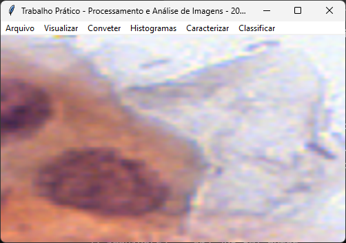
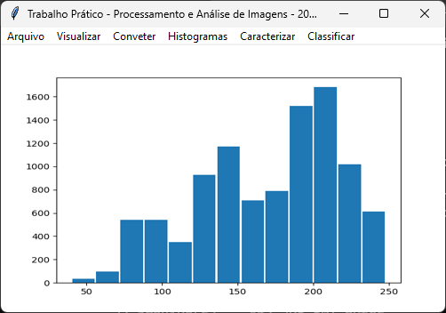
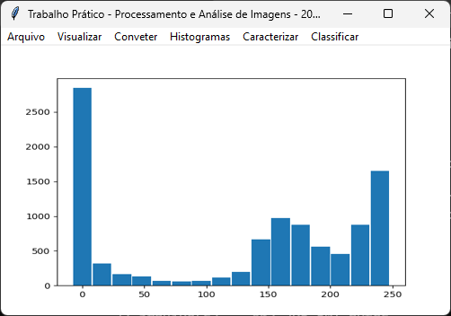
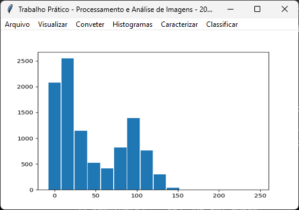
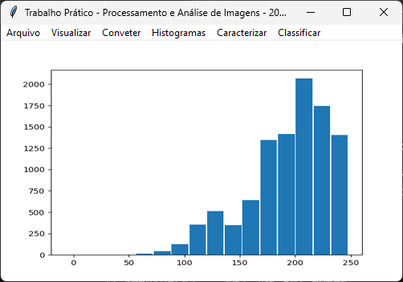
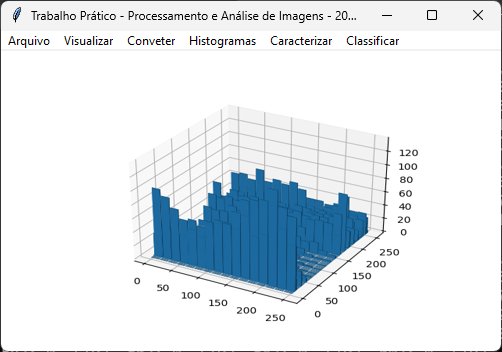

[English Version](README.EN.md)

# Trabalho Prático - Processamento e Análise de Imagens - 2024-1

## Enunciado

### Reconhecimento de células em exames de Papanicolau

**Data de entrega:** 11/06/2024 até às 23:00 pelo Canvas

**Valor: 35** pontos

**Penalidade por atraso: Valor total, não se admite atraso!**

**Grupos:** 2 ou 3 componentes

#### Descrição:

O Papanicolau é um exame histológico realizado para detectar alterações nas células do colo do útero. sendo o principal método de detecção de lesões para o diagnóstico precoce do câncer cervical. Neste trabalho, você deverá implementar um aplicativo que leia imagens de exames de Papanicolau e possibilite o reconhecimento automático de células cancerosas.

#### Especificações do programa:

a) O programa deve ser implementado em C++, Python ou Java.

b) É permitido o uso de funções elementares de bibliotecas. Por função elementar entende-se uma função básica de manipulação de imagens, cujo resultado não seja a solução final do problema. Ex: leitura de arquivos, cálculo de histogramas, filtros, cálculo de distâncias, conversão entre formatos de imagens, cálculo de características, classificadores. O código principal que utiliza as funções deve ser original do grupo.

#### 1a etapa:

1\) Os dados usados no treinamento e teste dos classificadores devem ser preprocessados. Através da planilha classifications.csv. Obtenha as coordenadas dos núcleos das células das imagens disponíveis no dataset (apenas uma parte das imagens está disponível). Recorte as imagens, gerando uma sub-imagem 100x100 para cada célula e armazene em sub-diretórios de acordo com a sua classe. O nome da imagem deve ser o número da célula na planilha. O arquivo README.md contém a descrição das classes.

2\) Implemente um ambiente totalmente gráfico com um menu para as seguintes funcionalidades:

- Menu para ler e visualizar imagens nos formatos PNG e JPG. As imagens podem ter qualquer resolução; 
- Menu para converter a imagem para tons de cinza e exibi-la. 
- Menu para gerar o histograma de tons de cinza e o de cores no espaço HSV e exibi-los. 
- Menu para caracterizar a imagem em tons de cinza através de descritores de Haralick, mostrando os valores calculados. 
- Menu para caracterizar a imagem em tons de cinza e canais de cor através dos momentos invariantes de Hu mostrando os valores calculados. 
- Menu para classificar uma sub-imagem através das técnicas selecionadas para o grupo, indicando qual a classe encontrada.

3\) Implemente a funcionalidade de leitura e exibição das imagem em cores e em tons de cinza com opção de zoom;

4\) Implemente a funcionalidade de geração do histograma de tons de cinza da imagem com 16 tons.

5\) Implemente a funcionalidade de geração dos histogramas de cor da imagem com quantização de 16 valores para o canal H e 8 valores para o V (histograma 2D com 16*8 entradas).

6\) Calcular as matrizes de co-ocorrência Ci,i onde i=1,2,4,8,16 e 32, considerando 16 tons de cinza.

7\) Calcular os descritores de Haralick Entropia, Homogeneidade e Contraste para as matrizes de co-ocorrência do item anterior (3*6 características)

8\) Calcular os momentos invariantes de Hu para a imagem em 256 tons de cinza e para os 3 canais originais do modelo HSV (4*7 características)

#### 2a etapa: Para a especificação desta etapa, calcule os seguintes números:

NF=(soma dos números de matrícula dos componentes do grupo) mod 3

NC=(soma dos números de matrícula dos componentes do grupo) mod 2

ND=((soma dos números de matrícula dos componentes do grupo) mod 4) div 2

Se NF=0, as características usadas serão os valores do histograma 2D (HxV, 16*8 características) Senão se N=1, as características usadas serão os descritores de Haralick calculados (3*6 características), Senão as características usadas serão os momentos de Hu (4*7 características).

Se NC=0, o classificador raso será o SVM, senão será o XGBoost.

Se ND=0, o classificador profundo será a ResNet50 senão será a EfficientNet.

1\) Separe os dados em 2 conjuntos sorteados aleatoriamente: o conjunto de treino deve ter 80% dos dados e o de teste 20%. Cada classe deve ser separada nesta proporção de 4:1 nos conjuntos de treino e teste para garantir balanceamento.

2\) Implemente dois classificadores rasos para o problema, conforme NC, sendo o primeiro binário (classe negativa X demais) e o segundo com as 6 classes. Avalie a acurácia e mostre as matrizes de confusão de cada um. As características usadas como entrada para os classificadores dependem de NF.

3\) Implemente dois classificadores profundos para o problema, conforme ND, sendo o primeiro binário (classe negativa X demais) e o segundo com as 6 classes. Ajuste os pesos já disponíveis nas biblioteca que foram treinados com o ImageNet (fine tunning). Avalie a acurácia e mostre as matrizes de confusão de cada uma. Plote os gráficos de aprendizado (acurácia de treino e teste após cada época). As entradas para os classificadores são as sub-imagens recortadas.

4\) Compare os resultados obtidos entre as soluções.

5\) A documentação EM FORMATO LATEX E PDF CORREPONDENTE deve ser na forma de um artigo com estilo da SBC, contendo:

    a) A descrição do problema.

    b) Descrição das técnicas implementadas para a solução, principalmente dos classificadores e características.

    c) As referências das bibliotecas utilizadas na implementação.

    d) As medidas de tempo de execução para diversas imagens, descritores e hiperparâmetros do classificador.

    e) Análise dos resultados obtidos nos testes, exemplos de erros e acertos dos métodos.

    f) Referências bibliográficas.

#### O que entregar:

Arquivos fontes e documentação. Coloque todos os arquivos na raiz de um diretório cujo nome deve ser o número de matrícula de um dos componentes. Comprima o diretório e poste no Canvas (link em drive não serve) até a hora especificada. O tamanho total dos arquivos não deve ultrapassar 20 Mbytes. NÃO INCLUA A BASE DE DADOS!
   
Obs: Trabalhos de qualidade superior poderão ganhar pontos extras.

#### Artigo de referência:

Rezende, M.T., Silva, R., Bernardo, F.d.O. et al. Cric searchable image database as a public platform for conventional pap smear cytology data. Sci Data 8, 151 (2021). https://doi.org/10.1038/s41597-021-00933-8

## Capturas de tela


*Janela principal, quando o programa é iniciado.*



*Janela principal, quando uma imagem é aberta.*


*Janela principal, exibindo uma imagem em tons de cinza.*


*Janela principal, exibindo uma imagem HSV.*



*Janela principal, exibindo o histograma de uma imagem em tons de
cinza.*



*Janela principal, exibindo o histograma Hue da imagem HSV.*



*Janela principal, exibindo o histograma Saturation da imagem HSV.*



*Janela principal, exibindo o histograma Value da imagem HSV.*



*Janela principal, exibindo o histograma 2D da imagem HSV.*


*Janela principal, exibindo as opções para classificar a imagem.*


*Janela principal, mostrando os Momentos Invariantes de Hu.*


*Janela principal, mostrando os Descritores de Haralick.*

## Como executar

Para executar o programa, siga os seguintes passos:

### Baixe o projeto

Para baixar o projeto execute apenas um dos seguintes passos abaixo: 'Baixe o arquivo ZIP' ou 'Clone o Repositório'.

#### Baixe o arquivo ZIP

Baixe o arquivo ZIP deste projeto através deste [link](../archive/refs/heads/readme.zip).

Extraia o arquivo ZIP baixado.

#### Clone o repositório

Clique no botão 'Code' (em verde) e copie o link.

No shell (Terminal, Prompt de Comando ou PowerShell), digite:

```
git clone <URL-COPIADO>
```

### Use um ambiente virtual (opcional)

#### Crie o ambiente virtual

No shell (Terminal, Prompt de Comando ou PowerShell) dentro da pasta do projeto, digite:

```
python3 -m venv venv
```

ou

```
python -m venv venv
```

#### Ative o ambiente virtual

Se o seu shell (Terminal, Prompt de Comando ou PowerShell) for o bash do Linux ou Mac OS, dentro da pasta do projeto, digite:

```
source venv/bin/activate
```

Se o seu shell (Terminal, Prompt de Comando ou PowerShell) for o Prompt de Comando do Windows, dentro da pasta do projeto, digite:

```
venv\Scripts\activate.bat
```

Se o seu shell (Terminal, Prompt de Comando ou PowerShell) for o PowerShell do Windows, dentro da pasta do projeto, digite:

```
.\venv\Scripts\Activate.ps1
```

### Instale os pacotes

No shell (Terminal, Prompt de Comando ou PowerShell) dentro da pasta do projeto, digite:

```
pip install -r requirements.txt
```

### Baixe os modelos de classificação

Em [releases](https://github.com/Henriquemcc/Trabalho_Pratico_-_Processamento_e_Analise_de_Imagens_-_2024-1/releases), baixe o arquivo ['inteligencia-20240617T013308Z-001.zip'](https://github.com/Henriquemcc/Trabalho_Pratico_-_Processamento_e_Analise_de_Imagens_-_2024-1/releases/download/0/inteligencia-20240617T013308Z-001.zip) e extraia os arquivos.

Crie uma pasta chamada 'inteligencia' na raiz do projeto e coloque os arquivos 'svm.pkl' e 'resnet50.h5' dentro dela.

### Execute o programa

No shell (Terminal, Prompt de Comando ou PowerShell) dentro da pasta do projeto, digite:

```
python3 app
```

ou

```
python app
```

E uma janela do programa se abrirá.

## Membros do Grupo

[Felipe Costa Amaral](https://github.com/Flipecs)

[Henrique Mendonça Castelar Campos](https://github.com/Henriquemcc)

[Larissa Kaweski Siqueira](https://github.com/larissakaweski)